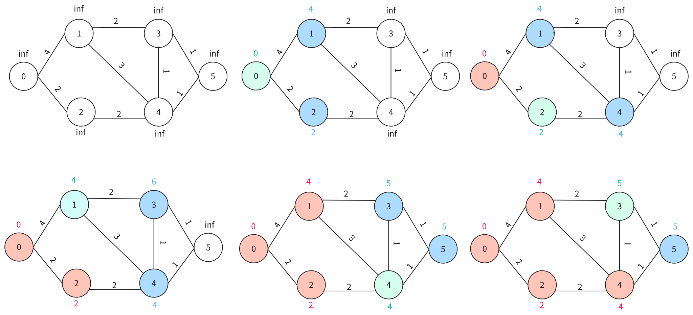

图的最短路径（Shortest Path）的定义是指在图中从一个起始节点（源节点）到另一个目标节点的路径中，所有边的权重之和最小的路径。最短路径问题的目标是找到这种路径，以使得路径的总权重（或成本）尽可能小。

具体来说，图的最短路径问题可以大致分为以下两种情况：

 - 单源最短路（仅有一个起点）
 - 多源汇最短路（每对节点之间）

根据图的情况不同（是否有负权边、是否有负环等）又会有很多种问题。求解最短路径的算法很多，适用的情况也各不相同。

## **Dijkstra与单源最短路**

Dijkstra算法可以解决**不含负权边的图**的单源最短路问题。

算法的核心思想：维护一组节点集合$S$，$S$集合中的每一个点都已找到从源结点开始的最短路径。

记所有节点的集合为$V$，算法的过程大致如下：

- 在集合$V-S$中找一个预估路径最短的点u，添加进$S$中
- 用该点对其相邻所有边做一次「松弛」操作，更新其邻接点的路径长度
- 重复上述步骤直至$S = V$，即所有节点都被添加进$S$内

> 松弛操作：记编号为i的点的路径长度为$d[i]$。对于边$e$，其起点与终点分别为$u、v$，若$d[v] < d[u] + w(u, v)$，则把$d[v]$更新为$d[u] + w(u, v)$



如上图，维护的集合$S$依次添加$0、2、1、4、3、5$节点，Dijkstra算法结束。

代码实现需要以下部分:

- 建立一个数组dist用于记录每个节点到起点的最短路，并初始化为inf
- 建立一个数组st用于模拟集合S
- 用最小优先队列heap维护每个节点的预估最短路径长度
- 每次取heap的顶对其接边做松弛操作，并将被更新的节点入队，直至所有节点都被更新完毕

具体代码实现如下：
```cpp
const int inf = 0x3f3f3f3f;
typedef pair<int, int> PII; // 第一个变量为路径长度，第二个变量为节点编号

priority_queue<PII, vector<PII>, greater<PII>> heap;
int st[MAX]; // 模拟集合S
int s, ed; // 记起点为s，终点为ed

/*这里的存图方法使用的是链式向前星，可以参考图的存储部分内容*/

int dijkstra() {
    int dist[MAX];
    memset(dist, 0x3f, sizeof dist);
    dist[s] = 0; // 先对源节点进行更新
    heap.push({0, s});

    while(heap.size()) {
        auto t = heap.top();
        heap.pop();
        int ver = t.second, distance = t.first;

        if(st[ver]) continue; // 如果堆顶节点已经被置入集合S，则不必再对其操作

        for(int id = head[ver]; id != -1; id = ne[id]) {
            if(dist[e[id]] < distance + w[id]) {
                dist[e[id]] = distance + w[id];
                heap.push({dist[e[id]], e[id]});
            }
        }

        st[ver] = 1;
    }

    return dist[ed];
}
```

推荐完成[洛谷 P4779 【模板】单源最短路径（标准版）](https://www.luogu.com.cn/problem/P4779)

----------------------
参考文章：<br>
《算法导论（第三版）》- Thomas H.Cormen Charles E.Leiserson Ronald L.Rivest Clifford Stein<br>
[CSDN_如何理解最短路径中的“松弛”操作](https://blog.csdn.net/dshf_1/article/details/108144085)<br>
[最短路-Oi Wiki](https://oi-wiki.org/graph/shortest-path/)